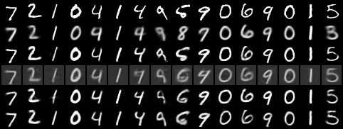
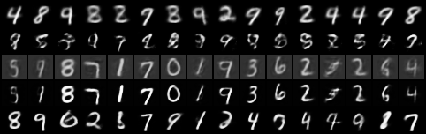

# Continuous Bernulli Variational Autoencoder

## Introduction

In this project, I am exploring the use of probabilistic deep learning models, in particular Variational Autoencoders, for the task of image generation.
I will be using several different VAEs to generate images of digits from the MNIST dataset.
The models will be trained using PyTorch and the results will be evaluated using the ELBO loss and the log-likelihood of the test data.

## Installation

Make sure you have a NVIDIA GPU with CUDA installed.
If not, you need to change the docker file to use the CPU version of PyTorch and change the `device` in the code to `cpu`.

To prepare the environment, run the following commands:

```bash
docker compose up
```

This will build a Docker image with all the necessary dependencies and start a container with Jupyter Lab running on port 8888.

You might also want to create some folders to store the data and the results.

## Inspiration

The project is inspired by the paper [Auto-Encoding Variational Bayes](https://arxiv.org/abs/1312.6114) by Kingma and Welling and another paper [The Continuous Bernoulli: fixing a pervasive error in variational autoencoders](https://arxiv.org/abs/1907.06845) by Loaiza-Ganem and Cunningham.

As pointed out in the paper by Loaiza-Ganem and Cunningham, the standard Bernoulli distribution is, mathematically, not suitable for modeling continuous data, such as pixel values in images. Bernoulli distribution is a discrete distribution with 0 or 1 as output, but the pixel value can be 0 to 255, or 0 to 1 if you scaled it.

Thus, the paper proposed a Continuous Bernoulli distribution that can model continuous data. The Continuous Bernoulli distribution is defined as follows:

```math
\begin{align*}
    p(x|\lambda) &= C(\lambda)x^{\lambda}(1 - \lambda)^{1-x}, \text{ where } C(\lambda) =
    \begin{cases}
        \frac{\lambda}{2\text{tanh}^{-1}(1 - 2\lambda)} & \text{if } \lambda \neq 0.5 \\
        0.5 & \text{otherwise}
    \end{cases}\\

    \mu(\lambda) &:= \mathbb{E}[X] =
    \begin{cases}
        \frac{1}{2\lambda - 1} + \frac{1}{2\text{tanh}^{-1}(1 - 2\lambda)} & \text{if } \lambda \neq 0.5 \\
        0.5 & \text{otherwise}
    \end{cases}
\end{align*}
```

where $\lambda\in(0,1)$.

To see more properties of the Continuous Bernoulli distribution, please refer to the [paper](https://arxiv.org/abs/1907.06845).

## Recreating the results

As stated in the [Appendix](https://arxiv.org/src/1907.06845v5/anc/cont_bern_appendix.pdf) of the paper by Loaiza-Ganem and Cunningham, their model

- 2 500-unit encoder layers with ReLU activation and dropout rate of 0.1
- outout layer of mean with no activation and standard deviation with a softplus activation
- latent space with 20 dimensions
- 2 500-unit decoder layers with ReLU activation and dropout rate of 0.1

This model is trained on the MNIST dataset for 100 epochs with a learning rate of 0.001 and Adam optimizer.

The original model is written in tensorflow, but I will be using PyTorch for this project.
You can see the relevent models in the [models.py](models.py) file.
Thus, certain cost function also needs to be re-written in numerically stable way.

One most important function is the `sumlogC()` which is a numerically stable implementation of sum of logarithm of Continous Bernoulli constant C, using Taylor 2nd degree approximation.
I used code from [Robert Aduviri](https://robert-alonso.github.io/) and [Alfredo de la Fuente](https://alfo5123.github.io/) and their code can be found in [Continuous-Bernoulli-VAE](https://github.com/Robert-Aduviri/Continuous-Bernoulli-VAE).
Some other loss functions can be found in the [loss_functions.py](loss_functions.py) file.

### Preliminary Results

The results of the model are shown in the following figures:

<figure align="center">
  
  <figcaption>Reconstructon. Top to bottom: Test data, VAE2, VAE20, CBVAE-Mean, CBVAE-Lambda, BetaVAE</figcaption>
</figure>

The sampling results are shown in the following figures:

<figure align="center">
  
  <figcaption>Sampling. Top to bottom: VAE2, VAE20, CBVAE-Mean, CBVAE-Lambda, BetaVAE</figcaption>
</figure>

See more details in the writeup. 

## Acknowledgements

This project is an adaptation from my previous course project in the course [Probabilistic Machine Learning](https://kurser.ku.dk/course/NDAK21004U/2023-2024) at University of Copenhagen.

One function is taken from [Robert Aduviri](https://robert-alonso.github.io/) and [Alfredo de la Fuente](https://alfo5123.github.io/) and their code can be found in  [Continuous-Bernoulli-VAE](https://github.com/Robert-Aduviri/Continuous-Bernoulli-VAE).

See some of the original work [here](https://github.com/Minhao-Zhang/PML_Final_2023_B2).
