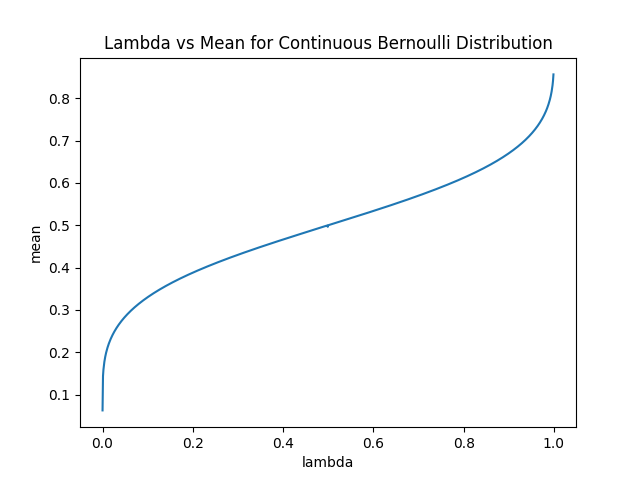
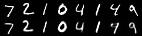

# An Anlysis of differen models 

## Introduction 

After implementing the Continuous Bernoulli Variational Autoencoder, we can perform a comparison with other models. 

## Bernoulli Variational Autoencoder

In the Bernoulli Variational Autoencoder, we use the Bernoulli distribution to model the pixel values of the images. 
Due to some reason, my implementation of the Bernoulli VAE is not working not to my expectation. 

The model with 20 dimensional latent space seems to perform extremely well on reconstructing the images. 
The edge is very sharp, digit is bright, and the background is black. 
However, if we look at the sampling of this model, we see that it fails to generate recognizable images. 
The image text looks like random strokes with no clear pattern at all. 
This is a clear pattern of overfitting. 

<figure align="center">
  
  
  <figcaption>Reconstructon (L) and Sampling (R)</figcaption>
</figure>

---

However, if we recude the latent spcace to 2, the model does perform better. 
The reconstruction image is not as sharp as the 20 dimensional model, but the sampling image is much better. 
Though the image is not very sharp, you are still able to distinguish between the different digits.

<figure align="center">
  
  
  <figcaption>Reconstructon (L) and Sampling (R)</figcaption>
</figure>

This could be due to the fact that there are some problem in the back propagation of the model. 
This could also be due to the fact that my neural network is not robust enough. 
Currently, the reason behind this is still awaiting further investigation. 

## Continuous Bernoulli Variational Autoencoder

The Continuous Bernoulli Variational Autoencoder is a model that assumed a continuous Bernoulli distribution on the pixel values of the images.
After training with 100 epoches, the model is able to generate images that are very similar to the original images. 
The reconstruction of the original image is very good and the sampling of the model, looks blurry, but recognizable as a digit.
However, there are also a lot of digits int he generated image that have some excessive strokes. 
Though most of them are faint, they are still impacting on the overall quality of the generated image.

Another thing you cannot miss is that the generated image has a grey background and the digit is not as bright as the original image. We will discuss this in the next section. 
 
<figure align="center">
  
  
  <figcaption>Reconstructon (L) and Sampling (R)</figcaption>
</figure>

## Problem with my Implementation 

My previous model usded the mean of the Continuous Bernoulli distribution to generate the image. As the mean is only dependent ont the $\lambda$, we can investigate its values. 

<figure align="center">
  
</figure>

As we can see, if the $\lambda$ is close to 0, the mean is still quite large. This also applies to the other end of the line where the $\lambda$ is close to 1, but the mean is still much less than that. 

$\lambda$ | Mean of Continuous Bernoulli
--- | ---
$10^{-7}$ | 0.06272575259208679
$10^{-6}$ | 0.07238142192363739
$10^{-5}$ | 0.08684897422790527
$10^{-4}$ | 0.10847478359937668
$10^{-3}$ | 0.1437837928533554
$10^{-2}$ | 0.20741809904575348
$10^{-1}$ | 0.33011960983276367

As you can also see in the table above, the mean decreases very slowly around 0. 
Hence, our model is not able to generate a pixel value close to 0 resulting in a grey backgound. 

We could try to use $\lambda$ itself to generate the image. 
Here are the results. 

<figure align="center">
  
  
  <figcaption>Reconstructon (L) and Sampling (R)</figcaption>
</figure>

Here, you can see that the generated image is much better. 
The edge is very sharp, most digits are recognizable, and the background is black. 